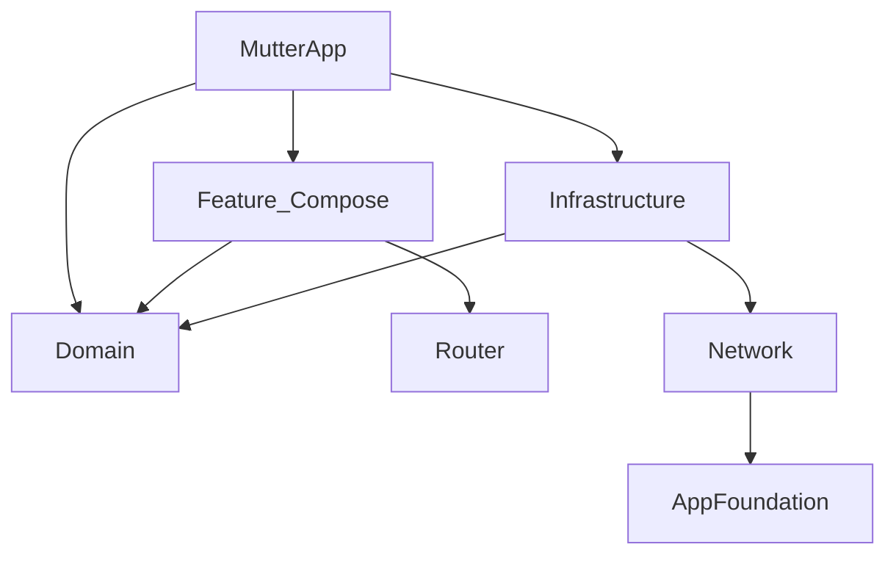

# tuist-dep-check

모듈 간 의존성을 분석하여 CLAUDE.md의 Dependency Rules 위반을 탐지한다.

## 작업 순서

1. 먼저 모든 모듈의 `Project.swift`를 읽는다 (추측 대신 파일에서 확인)
2. 각 모듈의 `dependencies` 추출
3. CLAUDE.md의 허용/금지 규칙과 비교
4. 코드 레벨 import 위반 탐지 (Domain 플랫폼 import · Feature 간 import · Infrastructure 역방향 — 상호 독립적이므로 동시에 실행 가능)
5. 발견된 위반을 모두 보고한 뒤 심각도로 우선순위화하여 Mermaid 다이어그램과 함께 출력

## 분석 대상

```
Projects/MutterApp/Project.swift
Projects/AppFoundation/Project.swift
Projects/Domain/Project.swift
Projects/Infrastructure/Project.swift
Projects/Network/Project.swift
Projects/Router/Project.swift
Projects/UIComponent/Project.swift
Projects/Feature/*/Project.swift  (모든 Feature 모듈)
```

## 의존성 규칙 (CLAUDE.md Dependency Rules 기준)

### 허용되는 의존 관계

```
MutterApp        → 모든 모듈
Feature        → Domain, Router, UIComponent, AppFoundation, Infrastructure, Network
Infrastructure → Domain, Network, AppFoundation
Network        → AppFoundation
Domain         → (없음 — 순수 Swift, Foundation만 허용)
UIComponent    → AppFoundation
Router         → AppFoundation
```

### 금지된 의존 관계

| 위반 유형 | 근거 |
|-----------|------|
| Feature → Feature | "Feature 모듈 간 직접 의존을 금지한다" (팀 규칙 #5) |
| Domain → Infrastructure | "Domain → Infrastructure 금지" (Dependency Rules) |
| Domain → Network | "Domain → Network 금지" (Dependency Rules) |
| Domain → UIKit / SwiftUI | "Domain Layer는 순수 Swift 코드로 유지" (Architecture Principles #4) |
| Infrastructure → Feature | 역방향 의존 |
| Network → Feature | 역방향 의존 |
| Network → Domain | 역방향 의존 |

## 코드 레벨 위반 탐지

Project.swift 의존성 외에, 실제 코드의 `import` 문도 검사한다:

### Domain 모듈 내 플랫폼 import

`Projects/Domain/` 내에서 `import SwiftUI`, `import UIKit` 검색

### Feature 내 다른 Feature import

`Projects/Feature/` 내에서 다른 Feature 모듈 이름의 import 검색
(자기 자신 모듈 제외)

### Infrastructure의 역방향 의존

`Projects/Infrastructure/` 내에서 Feature 모듈 import 검색

## 출력 형식

### 위반 목록

먼저 발견 단계로 저확신·저심각도 포함 모두 나열하고(확인/가설 구분), 이어서 필터 단계로 심각도 라벨(`[CRITICAL]`/`[HIGH]`/`[MEDIUM]`/`[LOW]`)을 붙여 우선순위화한다.

```
[CRITICAL][위반] Feature/Auth → Feature/Home: Feature 간 직접 의존 (팀 규칙 #5)
[HIGH][위반] Domain/Sources/SomeFile.swift → import SwiftUI: Domain의 플랫폼 의존 (Architecture Principles #4)
```

위반이 없으면:
```
의존성 위반 없음
```

### Mermaid 다이어그램

현재 모듈 의존성 그래프를 Mermaid로 출력한다:



## 위반 발견 시 수정 가이드

| 위반 | 수정 방법 |
|------|-----------|
| Feature → Feature | Router 또는 Domain을 통한 간접 통신으로 변경 |
| Domain → 플랫폼 | import 제거, Foundation만 허용 |
| 역방향 의존 | 의존 방향 반전 또는 프로토콜 추출로 분리 |
